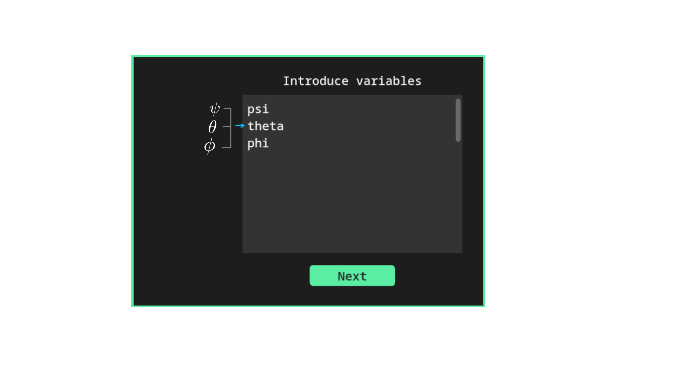
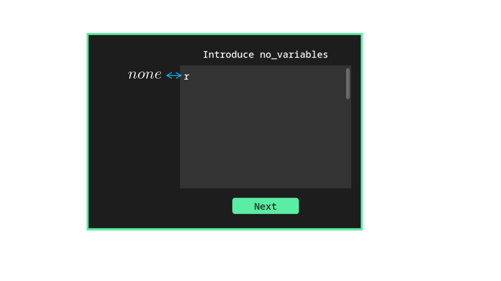
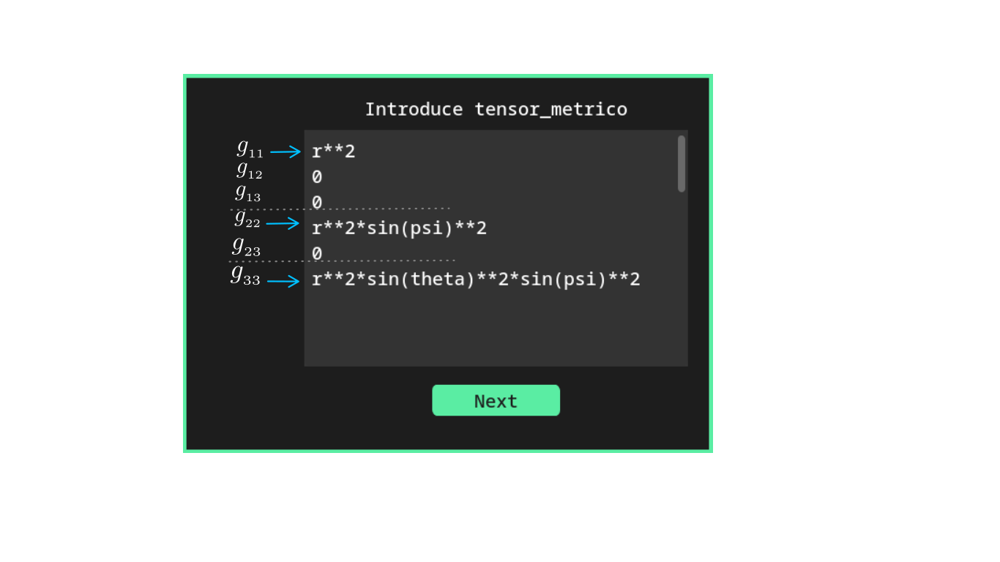

<p align="center">
  
</p>


<h2 align="center"> Metric3 </h2>


## Description 

Metríc3 is a project developed in Python, compatible with any Linux operating system. It is responsible for 
performing calculations of Christoffel symbols, the Riemann tensor, the Ricci tensor, and the scalar curvature.

The distinctive features of this project include that, for performing the aforementioned calculations, 
it utilizes a user interface that allows explicit input of the metric tensor. For displaying results, 
it uses LaTeX to construct a PDF document containing the calculation results in mathematical language 
and organized in matrix form.

<details>
<summary>English Documentation</summary>

## Table of Contents

- [Installation](#installation)
    - [Automated Installation](#automated-installation)
        - [Prerequisites](#prerequisites)
        - [Arch](#arch)
        - [Fedora](#fedora)
    - [Manual Installation](#manual-installation)
- [Uninstallation](#uninstallation)
- [Using the Program](#using-the-program)


## Installation
We will develop the manual installation guide for Metríc3 specifically for Arch Linux. 
Therefore, the installation commands will be tailored for using the pacman package manager. 
However, if you are a user of Fedora-based or Debian-based distributions, you can use the respective package 
managers for those distributions.


### Automated Installation
Within the documentation, two scripts have been developed to automatically install and 
configure the Metríc3 program for Arch and Fedora. If you are using Debian-based distributions, 
you will need to proceed with manual installation.


#### Installation Steps using the Script

##### Prerequisites

Before installing Metríc3, LaTeX is required:

To install LaTeX on Arch Linux, it is recommended to use pacman to search for and check the 
availability of texlive packages:
```sh
pacman -Ss texlive
```
This way, you can customize the installation according to your needs, although it's recommended 
to perform a full installation to avoid issues such as missing fonts or LaTeX compilers.

For Fedora, it is suggested to follow the
[LaTeX Documentation for Fedora](https://docs.fedoraproject.org/en-US/neurofedora/latex/)
,and it is recommended to install Texlive-full. However, since this is a more comprehensive installation, 
please note that it will take a considerable amount of time.


Once LaTeX is installed, regardless of the Linux distribution type, clone the repository:
```sh
git clone https://github.com/Angell6991/metric.git ~/.config/metric
```

##### Arch
Grant execute permissions to the script:
```sh
chmod u+x ~/.config/metric/scripts/install_Arch.sh
```
Execute the script:
```sh
~/.config/metric/scripts/install_Arch.sh 
```
If everything has gone well, you can now run the program from anywhere on your system using:
```sh
metric3
```

##### Fedora
Grant execute permissions to the script:
```sh
chmod u+x ~/.config/metric/scripts/install_Fedora.sh
```
Execute the script:
```sh
~/.config/metric/scripts/install_Fedora.sh 
```
If everything has gone well, you can now run the program from anywhere on your system using:
```sh
metric3
```

### Manual Installation

#### Prerequisites

As a prerequisite for installing Metríc3 on the system, you need to have the following installed:
Zathura PDF viewer, Python programming language, Python package manager pip, LaTeX typesetting system.

Install Zathura along with its dependencies:
```sh
sudo pacman -S zathura zathura-pdf-mupdf zathura-ps zathura-djvu zathura-cb
```

Install LaTeX:
It is recommended to use pacman to search for and verify the availability of texlive packages:
```sh
pacman -Ss texlive
```
This way, you can customize the installation according to your needs, although it's recommended 
to perform a full installation to avoid issues such as missing fonts or LaTeX compilers.

If you want to perform a full installation of LaTeX using pacman:
```sh
sudo pacman -S texlive
```
And choose to install all packages.


Install Python along with its dependencies using pacman:
```sh
sudo pacman -S python python-pip python-sympy python-pandas python-pillow tk
```

Install Python dependencies and libraries that are not available in pacman but 
can be downloaded with pip:
```sh
pip install pylatex customtkinter pyinstaller
```
>[!IMPORTANT] 
>Before using pip, ensure that pip can install dependencies on the system. 
>In the case of Arch Linux, the system may deny installation permissions to pip. 
>To solve this issue, there are at least two options: the first is to grant 
>permissions to pip to install directly into the system, and the second is to 
>install with pip through a virtual environment.


#### Clone the Repository
Once the above programs and libraries are installed, proceed to clone the 
repository to the following path:
```sh
git clone https://github.com/Angell6991/metric.git ~/.config/metric
```

Now that the repository has been cloned, you can run the program without 
the need to mount it on the system, using the Python interpreter. 
Simply navigate to the directory where the repository was cloned:
```sh
cd ~/.config/metric
```
To start the program with the Python interpreter, execute the following command in the terminal:
```sh
python metric3.py 
```
This way, the program would be usable. However, if you wish to run it from any 
location in the system, I invite you to continue with the installation guide.

#### Packaging Metríc3 with PyInstaller

Once the repository has been cloned, navigate to the saved directory:
```sh
cd ~/.config/metric
```
Create the binary using PyInstaller:
```sh
pyinstaller --hidden-import=PIL._tkinter_finder --onefile metric3.py
```
Keep in mind that this process may take some time.


Once the binary creation process is complete, it will be located in the newly 
created "dist" directory within the "metric" directory. To mount the binary in the system, 
we will do it using a symbolic link: 
```sh
sudo ln -s ~/.config/metric/dist/metric3 /usr/local/bin/metric3
```
<!-- sudo ln -s /home/my_user/.config/metric/dist/metric3 /usr/local/bin/metric3 -->
<!-- Solo recuerda cambiar "my_user" por el nombre de usuario del equipo. -->


This way, you can now execute the program from anywhere on your system using:
```sh
metric3
```

## Uninstallation

If for any reason you wish to uninstall the Metric3 program, 
it's as simple as following these two steps:

Delete the directory where the repository was cloned:
```sh
rm -rf ~/.config/metric
```

Delete symbolic link:
```sh
sudo rm /usr/local/bin/metric3
```


## Using the Program

For the usage guide of Metríc3, let's consider the metric of a 3-sphere as an example:

$$
ds^{2} \hspace{0.5em}=\hspace{0.5em} r^{2} \hspace{0.5em} d \psi^{2}  \hspace{0.5em}+\hspace{0.5em} r^{2} \sin^{2} \psi \hspace{0.5em} d \theta^{2}\hspace{0.5em}+\hspace{0.5em} r^{2} \sin^{2} \psi \sin^{2} \theta \hspace{0.5em} d \phi^{2}
$$

Whose degrees of freedom are given by the coordinates:

$$
x^{i} =
\begin{pmatrix}
\psi \\ 
\theta \\
\phi \\
\end{pmatrix}
$$

Once this metric is identified, we can begin using Metríc3 by starting it with:

```sh
metric3
```

The first thing the program will show upon starting is a window that prompts for input variables. 
These variables are the coordinates representing the degrees of freedom of the metric:

<p align="center">
  
</p>

The way to enter the variables is shown in the previous image. 
It's important to note that when entering data into the program, 
it only recognizes the syntax used by Sympy in Python.

Once the variables are entered, click the "Next" button, which will display the following window:

<p align="center">
  
</p>

This window prompts for entering the non-variables or, in other words, 
the parameters that are constants in the metric. For example, in our 3-sphere metric, 
the radius "r" is constant, so this is where it is entered. It's important to keep two things in mind:

>[!TIP]
>First: If the metric has more than one constant parameter, 
>this window is where all of them should be entered, in a column format, 
>similar to how coordinates were entered in the previous window.


>[!TIP]
>Second: If the metric has no constant parameters, you should leave the word 
>"none" written in this window to avoid calculation issues in the program.

Once the constants or the parameter "none" are entered, click the "Next" button, 
which will proceed to display the window where we will enter the metric tensor:

$$
g_{ij} =
\begin{pmatrix}
r^{2} & 0 & 0 \\ 
0 & r^{2} \sin^{2} \psi & 0 \\
0 & 0 & r^{2} \sin^{2} \psi \sin^{2} \theta \\
\end{pmatrix} = \begin{pmatrix}
g_{11} & g_{12} & g_{13} \\ 
g_{21} & g_{22} & g_{23} \\
g_{31} & g_{32} & g_{33} \\
\end{pmatrix}
$$

To enter the metric tensor, you only need to consider the upper triangular part of the matrix, 
as Metríc3 recognizes the metric tensor as a symmetric matrix. To avoid entering unnecessary data, 
the program only requires the upper triangular part of the matrix.


The way to enter the data is as follows: you start by entering the first row of the matrix. 
After that, you continue with the second row, starting from the main diagonal of the matrix. 
You follow this process successively until you have entered the entire upper triangular part, 
as shown in the following image:

<p align="center">
  
</p>

>[!NOTE]
>All components of the metric tensor must always be entered vertically, as shown in the image.

Once the metric tensor is entered, click the "Next" button and the program will 
proceed to start the calculation. Once the calculation is finished, 
you will have the option to view the results in a PDF document.

This PDF document is always saved with the name "Metric_doc.pdf" in the directory:
```sh
~/
```
>[!NOTE] 
>Each time Metríc3 is run, the document "Metric_doc.pdf" will be affected by changes 
>in the data entered into the program. Therefore, if you wish to save the results of a 
>previously calculated metric, simply rename "Metric_doc.pdf" to something else. 
>This way, when you run Metríc3 again, a new "Metric_doc.pdf" will be generated 
>that will not overwrite the previously obtained one.

</details>


## Descripción

Metríc3 es un proyecto desarrollado en Python, compatible con cualquier sistema operativo Linux. 
Se encarga de realizar los cálculos de los símbolos de Christoffel, el tensor de Riemann, 
el tensor de Ricci y el escalar de curvatura.

Las características distintivas de este proyecto son que, para realizar los cálculos mencionados 
anteriormente, hace uso de una interfaz de usuario que permite introducir de manera explícita el 
tensor métrico. Para el despliegue de resultados, utiliza LaTeX para construir un documento PDF 
que contiene los resultados de los cálculos en lenguaje matemático y ordenados de forma matricial.


<details>
<summary>Documentación en español</summary>

## Tabla de Contenidos

- [Instalación](#instalación)
    - [Instalación automatizada](#instalación-automatizada)
        - [Prerrequisitos](#prerrequisitos)
        - [Arch](#arch)
        - [Fedora](#fedora)
    - [Instalación manual](#instalación-manual)
- [Desinstalación](#desinstalación)
- [Uso del Programa](#uso-del-programa)


## Instalación
La guía de instalación manual de Metríc3 la desarrollaremos para Arch. Por lo tanto, los comandos 
de instalación estarán orientados al uso del gestor de paquetes pacman. Sin embargo, si eres usuario 
de distribuciones basadas en Fedora o Debian, bastará con hacer uso de los gestores de dichas distribuciones.


### Instalación automatizada
Dentro de la documentación se han desarrollado, por el momento, dos scripts que proceden a 
instalar y configurar de manera automática el programa Metríc3 para Arch y Fedora. En caso 
de usar distribuciones basadas en Debian, se tendrá que seguir con la instalación manual.


#### Pasos instalación con el script 

##### Prerrequisitos

Antes de instalar Metríc3, se requiere tener LaTeX:

Para instalar LaTeX en Arch, se recomienda hacer uso de pacman para buscar y ver la disponibilidad 
de los paquetes de texlive:
```sh
pacman -Ss texlive
```
De esta forma, la instalación la podrás realizar de forma personalizada según tus necesidades, 
aunque se recomienda realizar una instalación tipo full para evitar problemas como la falta 
de fuentes o compiladores de LaTeX.

Para Fedora se sugiere seguir la 
[Documentación de LaTex en Fedora](https://docs.fedoraproject.org/en-US/neurofedora/latex/)
,y se recomienda instalar Texlive-full. Sin embargo, al ser una instalación más completa, 
hay que tener en cuenta que esta instalación llevará un tiempo considerable.


Una vez instalado LaTeX, sin importar el tipo de distribución de Linux, clona el repositorio:
```sh
git clone https://github.com/Angell6991/metric.git ~/.config/metric
```

##### Arch
Dar permisos de ejecución al script:
```sh
chmod u+x ~/.config/metric/scripts/install_Arch.sh
```
Ejecutar el script:
```sh
~/.config/metric/scripts/install_Arch.sh 
```
Si todo ha salido bien, ya podemos ejecutar el programa desde cualquier 
parte del equipo a través de:
```sh
metric3
```

##### Fedora
Dar permisos de ejecución al script:
```sh
chmod u+x ~/.config/metric/scripts/install_Fedora.sh
```
Ejecutar el script:
```sh
~/.config/metric/scripts/install_Fedora.sh 
```
Si todo ha salido bien, ya podemos ejecutar el programa desde cualquier 
parte del equipo a través de:
```sh
metric3
```

### Instalación manual

#### Prerrequisitos
Como requisito previo para instalar Metríc3 en el sistema, se necesita tener instalados el 
visor de PDF Zathura, el lenguaje de programación Python, el gestor de paquetes de Python 
pip y el sistema de composición de texto LaTeX.

Instalar Zathura junto con sus dependencias:
```sh
sudo pacman -S zathura zathura-pdf-mupdf zathura-ps zathura-djvu zathura-cb
```


Instalar LaTeX:
Se recomienda hacer uso de pacman para buscar y verificar la disponibilidad de los paquetes 
de texlive:
```sh
pacman -Ss texlive
```
De esta forma, la instalación la podrás realizar de forma personalizada según tus necesidades, 
aunque se recomienda realizar una instalación tipo full para evitar problemas como la falta de
fuentes o compiladores de LaTeX.

En caso de querer hacer la instalación completa de LaTeX con pacman:
```sh
sudo pacman -S texlive
```
Y elegir la instalación de todos los paquetes.


Instalar Python junto con sus dependencias utilizando pacman:
```sh
sudo pacman -S python python-pip python-sympy python-pandas python-pillow tk
```
Instalar las dependencias y bibliotecas de Python que no están disponibles en pacman y que 
se pueden descargar con pip:
```sh
pip install pylatex customtkinter pyinstaller
```
>[!IMPORTANT] 
>Antes de usar pip, asegúrate de que pip pueda instalar dependencias en el sistema. 
>En el caso de usar Arch, este sistema puede negar los permisos de instalación a pip. Para 
>solucionar este problema, hay al menos dos opciones: la primera es otorgar permisos a pip 
>para instalar directamente en el sistema, y la segunda es instalar con pip a través de un 
>entorno virtual.


#### Clonar el repositorio
Una vez instalados los programas y librerías anteriores, se procede a clonar 
el repositorio en la ruta:
```sh
git clone https://github.com/Angell6991/metric.git ~/.config/metric
```

Ya que se ha clonado el repositorio, se puede ejecutar el programa sin necesidad 
de montarlo en el sistema, a través del intérprete de Python. Solo hay que dirigirse 
al directorio en el cual se clonó el repositorio:
```sh
cd ~/.config/metric
```
Y para iniciar el programa con el intérprete de Python, se ejecuta en la terminal:
```sh
python metric3.py 
```
De esta forma, el programa ya sería usable. Sin embargo, si se desea ejecutarlo 
desde cualquier parte del sistema, te invito a seguir con la guía de instalación.


#### Montando Metric3 con PyInstaller
Una vez clonado el repositorio, nos dirigimos al directorio de guardado:
```sh
cd ~/.config/metric
```
Creamos el binario haciendo uso de PyInstaller:
```sh
pyinstaller --hidden-import=PIL._tkinter_finder --onefile metric3.py
```
Ten presente que este proceso puede llevar un tiempo.

Una vez terminada la creación del binario, este se encontrará en el 
directorio "dist" recién creado dentro del directorio "metric". 
Para montar el binario en el sistema, lo realizaremos mediante un enlace simbólico: 
```sh
sudo ln -s ~/.config/metric/dist/metric3 /usr/local/bin/metric3
```
<!-- sudo ln -s /home/my_user/.config/metric/dist/metric3 /usr/local/bin/metric3 -->
<!-- Solo recuerda cambiar "my_user" por el nombre de usuario del equipo. -->

De esta manera, ya podemos ejecutar el programa desde cualquier parte del equipo 
a través de:
```sh
metric3
```

## Desinstalación
Si por alguna razón desea desinstalar el programa Metric3, es tan sencillo como 
seguir estos dos pasos:

Eliminar el directorio donde se clonó el repositorio:
```sh
rm -rf ~/.config/metric
```

Eliminar el enlace simbólico:
```sh
sudo rm /usr/local/bin/metric3
```


## Uso del Programa
Para la guía de uso de Metríc3, consideremos la métrica de una 3-esfera como ejemplo:

$$
ds^{2} \hspace{0.5em}=\hspace{0.5em} r^{2} \hspace{0.5em} d \psi^{2}  \hspace{0.5em}+\hspace{0.5em} r^{2} \sin^{2} \psi \hspace{0.5em} d \theta^{2}\hspace{0.5em}+\hspace{0.5em} r^{2} \sin^{2} \psi \sin^{2} \theta \hspace{0.5em} d \phi^{2}
$$

Cuyos grados de libertad están dados por las coordenadas:

$$
x^{i} =
\begin{pmatrix}
\psi \\ 
\theta \\
\phi \\
\end{pmatrix}
$$

Una vez identificado esto de la métrica, podemos empezar a usar Metríc3 iniciándolo con:

```sh
metric3
```

Lo primero que mostrará el programa al iniciar es una ventana que pedirá ingresar las variables. 
Estas variables son las coordenadas que representan los grados de libertad de la métrica:

<p align="center">
  
</p>


La forma de introducir las variables se muestra en la imagen anterior. Es importante tener 
en cuenta que al ingresar los datos en el programa, solo identifica la sintaxis de Sympy de Python.

Una vez introducidas las variables, damos clic en el botón "Next", con lo cual se despliega la 
siguiente ventana:

<p align="center">
  
</p>

Esta ventana pide introducir las no variables o, en otras palabras, los parámetros que son constantes 
en la métrica. Por ejemplo, en nuestra métrica de la 3-esfera, el radio "r" es constante, por lo que 
es en esta ventana donde se introduce. Es importante tener en cuenta dos cosas:

>[!TIP]
>Primero: si la métrica posee más de un parámetro constante, es en esta ventana donde todos estos se 
>deben introducir, en forma de columna, de la misma manera como se hace con las coordenadas en la 
>ventana anterior.

>[!TIP]
>Segundo: si la métrica no tiene parámetros constantes, se debe dejar la palabra "none" escrita en 
>esta ventana para evitar problemas de cálculo en el programa.


Una vez introducidas las constantes o el parámetro "none", damos clic en el botón "Next", con lo 
cual procedemos a desplegar la ventana donde introduciremos el tensor métrico:

$$
g_{ij} =
\begin{pmatrix}
r^{2} & 0 & 0 \\ 
0 & r^{2} \sin^{2} \psi & 0 \\
0 & 0 & r^{2} \sin^{2} \psi \sin^{2} \theta \\
\end{pmatrix} = \begin{pmatrix}
g_{11} & g_{12} & g_{13} \\ 
g_{21} & g_{22} & g_{23} \\
g_{31} & g_{32} & g_{33} \\
\end{pmatrix}
$$

Para introducir el tensor métrico, solo hay que tener en cuenta la parte triangular superior de 
la matriz, ya que Metric3 reconoce el tensor métrico como una matriz simétrica. Para evitar la 
introducción de datos innecesarios, el programa solo requiere la parte triangular superior de 
la matriz.

La forma de introducir los datos es la siguiente: se comienza siempre introduciendo la 
primera fila de la matriz. Una vez introducida la primera fila, se procede con la segunda, 
pero comenzando siempre desde la diagonal principal de la matriz. Se sigue este proceso 
sucesivamente hasta terminar de introducir toda la parte triangular superior, como se muestra 
en la siguiente imagen:

<p align="center">
  
</p>

>[!NOTE]
>Todas las componentes del tensor métrico siempre se deben introducir en vertical, 
>como se muestra en la imagen.

Una vez introducido el tensor métrico, hacemos clic en el botón "Next" y el programa procederá 
a iniciar el cálculo. Una vez finalizado el cálculo, se podrá disponer de la opción de ver los 
resultados en un documento PDF.

Este documento PDF siempre se guarda con el nombre "Metric_doc.pdf" en el directorio:
```sh
~/
```
>[!NOTE] 
>Cada vez que se ejecute Metríc3, el documento "Metric_doc.pdf" se verá afectado 
>por el cambio en los datos introducidos en el programa. Por lo tanto, si deseas guardar 
>los resultados de una métrica previamente calculada, bastará con cambiarle el nombre a 
>"Metric_doc.pdf" por otro. De esta forma, al ejecutar nuevamente Metríc3, se generará un 
>nuevo "Metric_doc.pdf" que no alterará el obtenido previamente.

</details>

