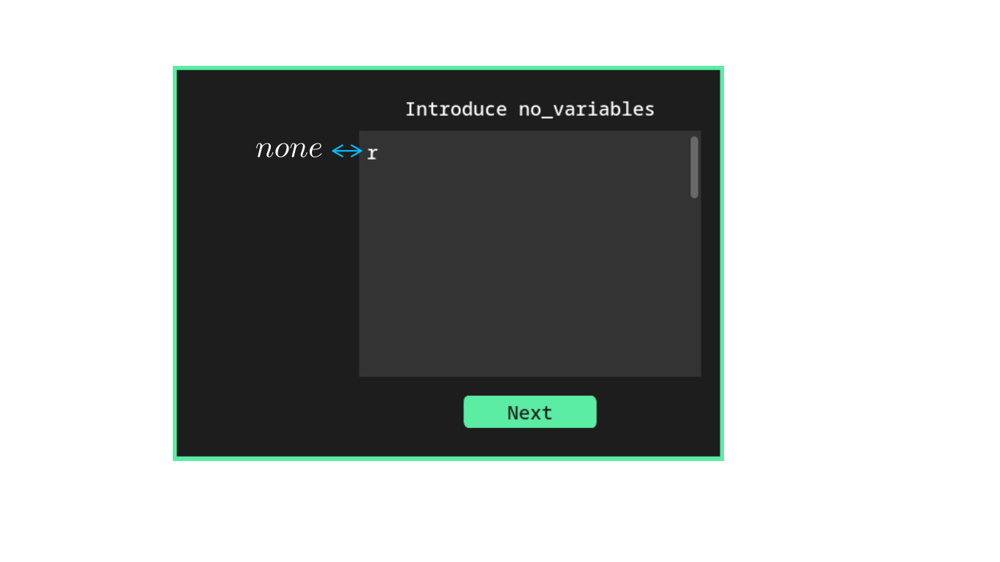
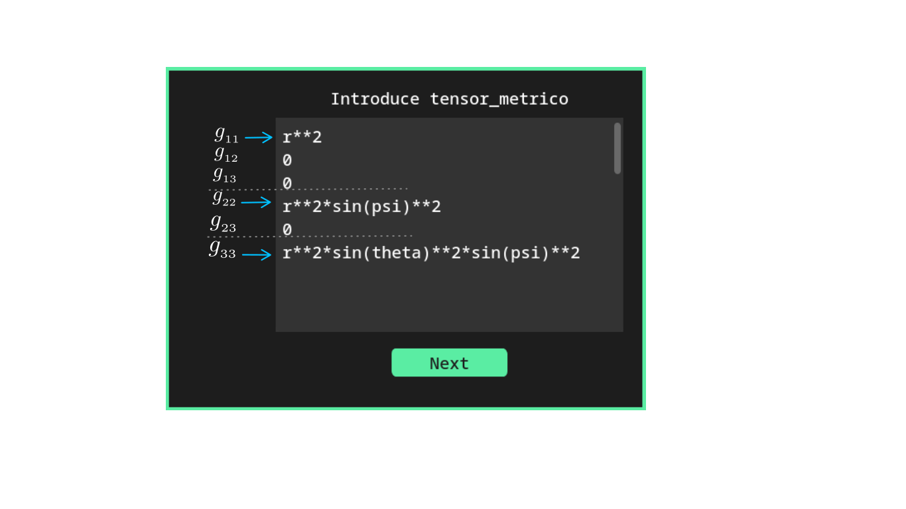

<p align="center">
  
</p>


<h2 align="center"> Metric3 </h2>


## Descripción
Metríc3 es un proyecto desarrollado en Python, compatible con cualquier sistema operativo Linux. 
Se encarga de realizar los cálculos de los símbolos de Christoffel, el tensor de Riemann, 
el tensor de Ricci y el escalar de curvatura.


Las características distintivas de este proyecto son que, para realizar los cálculos mencionados 
anteriormente, hace uso de una interfaz de usuario que permite introducir de manera explícita el 
tensor métrico. Para el despliegue de resultados, utiliza LaTeX para construir un documento PDF 
que contiene los resultados de los cálculos en lenguaje matemático y ordenados de forma matricial.


## Tabla de Contenidos

- [Instalación](#instalación)
    - [Instalación automatizada](#instalación-automatizada)
        -[Prerrequisitos](#prerrequisitos)
        -[Arch](#arch)
        -[Fedora](#fedora)
    - [Instalación manual](#instalación-manual)
- [Desinstalación](#desinstalación)
- [Uso del Programa](#uso-del-programa)


## Instalación
La guía de instalación manual de Metríc3 la desarrollaremos para Arch. Por lo tanto, los comandos 
de instalación estarán orientados al uso del gestor de paquetes pacman. Sin embargo, si eres usuario 
de distribuciones basadas en Fedora o Debian, bastará con hacer uso de los gestores de dichas distribuciones.


### Instalación automatizada
Dentro de la documentación se han desarrollado, por el momento, dos scripts que proceden a 
instalar y configurar de manera automática el programa Metríc3 para Arch y Fedora. En caso 
de usar distribuciones basadas en Debian, se tendrá que seguir con la instalación manual.


#### Pasos instalación con el script 

##### Prerrequisitos

Antes de instalar Metríc3, se requiere tener LaTeX:

Para instalar LaTeX en Arch, se recomienda hacer uso de pacman para buscar y ver la disponibilidad 
de los paquetes de texlive:
```sh
pacman -Ss texlive
```
De esta forma, la instalación la podrás realizar de forma personalizada según tus necesidades, 
aunque se recomienda realizar una instalación tipo full para evitar problemas como la falta 
de fuentes o compiladores de LaTeX.

Para Fedora se sugiere seguir la 
[Documentación de LaTex en Fedora](https://docs.fedoraproject.org/en-US/neurofedora/latex/)
,y se recomienda instalar Texlive-full. Sin embargo, al ser una instalación más completa, 
hay que tener en cuenta que esta instalación llevará un tiempo considerable.


Una vez instalado LaTeX, sin importar el tipo de distribución de Linux, clona el repositorio:
```sh
git clone https://github.com/Angell6991/metric.git ~/.config/metric
```

##### Arch
Dar permisos de ejecución al script:
```sh
chmod u+x ~/.config/metric/install_Arch.sh
```
Ejecutar el script:
```sh
~/.config/metric/install_Arch.sh 
```
Si todo ha salido bien, ya podemos ejecutar el programa desde cualquier 
parte del equipo a través de:
```sh
metric3
```

##### Fedora
Dar permisos de ejecución al script:
```sh
chmod u+x ~/.config/metric/install_Fedora.sh
```
Ejecutar el script:
```sh
~/.config/metric/install_Fedora.sh 
```
Si todo ha salido bien, ya podemos ejecutar el programa desde cualquier 
parte del equipo a través de:
```sh
metric3
```

### Instalación manual

#### Prerrequisitos
Como requisito previo para instalar Metríc3 en el sistema, se necesita tener instalados el 
visor de PDF Zathura, el lenguaje de programación Python, el gestor de paquetes de Python 
pip y el sistema de composición de texto LaTeX.

Instalar Zathura junto con sus dependencias:
```sh
sudo pacman -S zathura zathura-pdf-mupdf zathura-ps zathura-djvu zathura-cb
```


Instalar LaTeX:
Se recomienda hacer uso de pacman para buscar y verificar la disponibilidad de los paquetes 
de texlive:
```sh
pacman -Ss texlive
```
De esta forma, la instalación la podrás realizar de forma personalizada según tus necesidades, 
aunque se recomienda realizar una instalación tipo full para evitar problemas como la falta de
fuentes o compiladores de LaTeX.

En caso de querer hacer la instalación completa de LaTeX con pacman:
```sh
sudo pacman -S texlive
```
Y elegir la instalación de todos los paquetes.


Instalar Python junto con sus dependencias utilizando pacman:
```sh
sudo pacman -S python python-pip python-sympy python-pandas python-pillow tk
```
Instalar las dependencias y bibliotecas de Python que no están disponibles en pacman y que 
se pueden descargar con pip:
```sh
pip install pylatex customtkinter pyinstaller
```
>[!IMPORTANT] 
>Antes de usar pip, asegúrate de que pip pueda instalar dependencias en el sistema. 
>En el caso de usar Arch, este sistema puede negar los permisos de instalación a pip. Para 
>solucionar este problema, hay al menos dos opciones: la primera es otorgar permisos a pip 
>para instalar directamente en el sistema, y la segunda es instalar con pip a través de un 
>entorno virtual.


#### Clonar el repositorio
Una vez instalados los programas y librerías anteriores, se procede a clonar 
el repositorio en la ruta:
```sh
git clone https://github.com/Angell6991/metric.git ~/.config/metric
```

Ya que se ha clonado el repositorio, se puede ejecutar el programa sin necesidad 
de montarlo en el sistema, a través del intérprete de Python. Solo hay que dirigirse 
al directorio en el cual se clonó el repositorio:
```sh
cd ~/.config/metric
```
Y para iniciar el programa con el intérprete de Python, se ejecuta en la terminal:
```sh
python metric3.py 
```
De esta forma, el programa ya sería usable. Sin embargo, si se desea ejecutarlo 
desde cualquier parte del sistema, te invito a seguir con la guía de instalación.


#### Montando Metric3 con PyInstaller
Una vez clonado el repositorio, nos dirigimos al directorio de guardado:
```sh
cd ~/.config/metric
```
Creamos el binario haciendo uso de PyInstaller:
```sh
pyinstaller --hidden-import=PIL._tkinter_finder --onefile metric3.py
```
Ten presente que este proceso puede llevar un tiempo.

Una vez terminada la creación del binario, este se encontrará en el 
directorio "dist" recién creado dentro del directorio "metric". 
Para montar el binario en el sistema, lo realizaremos mediante un enlace simbólico: 
```sh
sudo ln -s ~/.config/metric/dist/metric3 /usr/local/bin/metric3
```
<!-- sudo ln -s /home/my_user/.config/metric/dist/metric3 /usr/local/bin/metric3 -->
<!-- Solo recuerda cambiar "my_user" por el nombre de usuario del equipo. -->

De esta manera, ya podemos ejecutar el programa desde cualquier parte del equipo 
a través de:
```sh
metric3
```

## Desinstalación
Si por alguna razón desea desinstalar el programa Metric3, es tan sencillo como 
seguir estos dos pasos:

Eliminar el directorio donde se clonó el repositorio:
```sh
rm -rf ~/.config/metric
```

Eliminar el enlace simbólico:
```sh
sudo rm /usr/local/bin/metric3
```


## Uso del Programa
Para la guía de uso de Metríc3, consideremos la métrica de una 3-esfera como ejemplo:

$$
ds^{2} \hspace{0.5em}=\hspace{0.5em} r^{2} \hspace{0.5em} d \psi^{2}  \hspace{0.5em}+\hspace{0.5em} r^{2} \sin^{2} \psi \hspace{0.5em} d \theta^{2}\hspace{0.5em}+\hspace{0.5em} r^{2} \sin^{2} \psi \sin^{2} \theta \hspace{0.5em} d \phi^{2}
$$

Cuyos grados de libertad están dados por las coordenadas:

$$
x^{i} =
\begin{pmatrix}
\psi \\ 
\theta \\
\phi \\
\end{pmatrix}
$$

Una vez identificado esto de la métrica, podemos empezar a usar Metríc3 iniciándolo con:

```sh
metric3
```

Lo primero que mostrará el programa al iniciar es una ventana que pedirá ingresar las variables. 
Estas variables son las coordenadas que representan los grados de libertad de la métrica:

<p align="center">
  
</p>


La forma de introducir las variables se muestra en la imagen anterior. Es importante tener 
en cuenta que al ingresar los datos en el programa, solo identifica la sintaxis de Sympy de Python.

Una vez introducidas las variables, damos clic en el botón "Next", con lo cual se despliega la 
siguiente ventana:

<p align="center">
  
</p>

Esta ventana pide introducir las no variables o, en otras palabras, los parámetros que son constantes 
en la métrica. Por ejemplo, en nuestra métrica de la 3-esfera, el radio "r" es constante, por lo que 
es en esta ventana donde se introduce. Es importante tener en cuenta dos cosas:

>[!TIP]
>Primero: si la métrica posee más de un parámetro constante, es en esta ventana donde todos estos se 
>deben introducir, en forma de columna, de la misma manera como se hace con las coordenadas en la 
>ventana anterior.

>[!TIP]
>Segundo: si la métrica no tiene parámetros constantes, se debe dejar la palabra "none" escrita en 
>esta ventana para evitar problemas de cálculo en el programa.


Una vez introducidas las constantes o el parámetro "none", damos clic en el botón "Next", con lo 
cual procedemos a desplegar la ventana donde introduciremos el tensor métrico:

$$
g_{ij} =
\begin{pmatrix}
r^{2} & 0 & 0 \\ 
0 & r^{2} \sin^{2} \psi & 0 \\
0 & 0 & r^{2} \sin^{2} \psi \sin^{2} \theta \\
\end{pmatrix} = \begin{pmatrix}
g_{11} & g_{12} & g_{13} \\ 
g_{21} & g_{22} & g_{23} \\
g_{31} & g_{32} & g_{33} \\
\end{pmatrix}
$$

Para introducir el tensor métrico, solo hay que tener en cuenta la parte triangular superior de 
la matriz, ya que Metric3 reconoce el tensor métrico como una matriz simétrica. Para evitar la 
introducción de datos innecesarios, el programa solo requiere la parte triangular superior de 
la matriz.

La forma de introducir los datos es la siguiente: se comienza siempre introduciendo la 
primera fila de la matriz. Una vez introducida la primera fila, se procede con la segunda, 
pero comenzando siempre desde la diagonal principal de la matriz. Se sigue este proceso 
sucesivamente hasta terminar de introducir toda la parte triangular superior, como se muestra 
en la siguiente imagen:

<p align="center">
  
</p>

>[!NOTE]
>Todas las componentes del tensor métrico siempre se deben introducir en vertical, 
>como se muestra en la imagen.

Una vez introducido el tensor métrico, hacemos clic en el botón "Next" y el programa procederá 
a iniciar el cálculo. Una vez finalizado el cálculo, se podrá disponer de la opción de ver los 
resultados en un documento PDF.

Este documento PDF siempre se guarda con el nombre "Metric_doc.pdf" en el directorio:
```sh
~/
```
>[!NOTE] 
>Cada vez que se ejecute Metríc3, el documento "Metric_doc.pdf" se verá afectado 
>por el cambio en los datos introducidos en el programa. Por lo tanto, si deseas guardar 
>los resultados de una métrica previamente calculada, bastará con cambiarle el nombre a 
>"Metric_doc.pdf" por otro. De esta forma, al ejecutar nuevamente Metríc3, se generará un 
>nuevo "Metric_doc.pdf" que no alterará el obtenido previamente.


