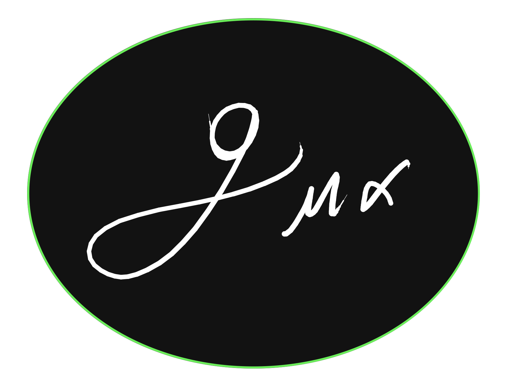

  

<h2 align="center"> Metric3 </h2>

## Description 

Metríc3 is a project developed in Python, compatible with any Linux operating system. It is responsible for 
performing calculations of Christoffel symbols, the Riemann tensor, the Ricci tensor, and the scalar curvature.

The distinctive features of this project include that, for performing the aforementioned calculations, 
it utilizes a user interface that allows explicit input of the metric tensor. For displaying results, 
it uses LaTeX to construct a PDF document containing the calculation results in mathematical language 
and organized in matrix form.

[English Documentation](support_files/EN.md)

## Descripción

Metríc3 es un proyecto desarrollado en Python, compatible con cualquier sistema operativo Linux. 
Se encarga de realizar los cálculos de los símbolos de Christoffel, el tensor de Riemann, 
el tensor de Ricci y el escalar de curvatura.

Las características distintivas de este proyecto son que, para realizar los cálculos mencionados 
anteriormente, hace uso de una interfaz de usuario que permite introducir de manera explícita el 
tensor métrico. Para el despliegue de resultados, utiliza LaTeX para construir un documento PDF 
que contiene los resultados de los cálculos en lenguaje matemático y ordenados de forma matricial.

[Documentación en español](support_files/LATAM.md)

